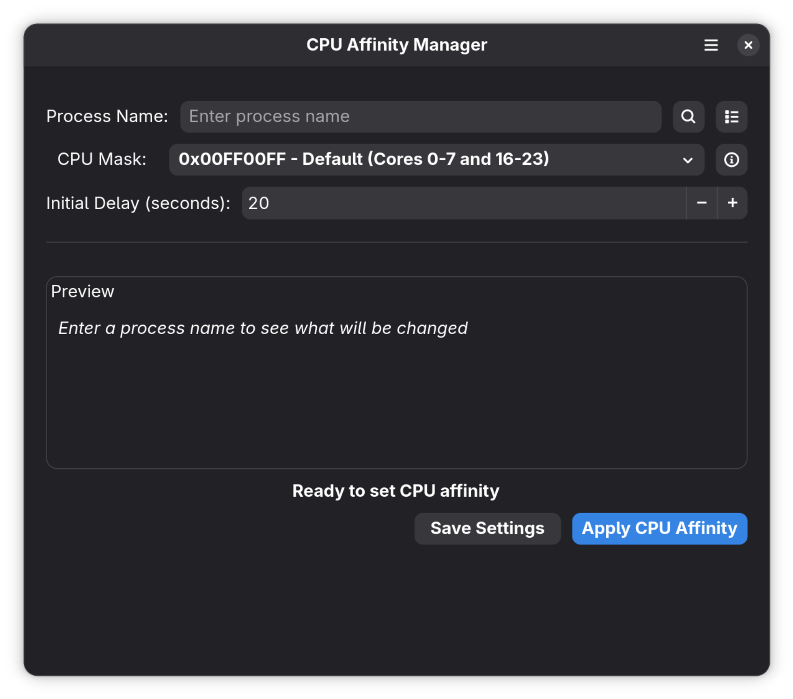
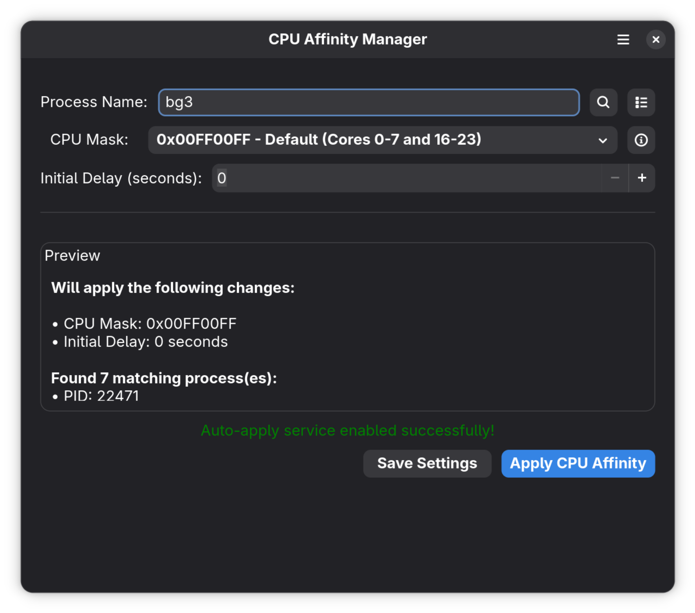

# CPU Affinity Manager

A GTK4/Libadwaita application to manage CPU affinity for processes on Linux. It is useful for AMD CPUs with multiple CCDs where only one has 3D V-Cache (e.g., Ryzen 7950X3D/9950X3D).

## Screenshots

### Main Window


### Process Search


## Disclaimer

This application was created with the assistance of Artificial Intelligence (AI) tools.

## Features

*   **Set CPU Affinity:** Assign specific CPU cores to running processes and their threads.
*   **Process Search:** Find processes by name.
*   **Thread-Level Control:** Applies affinity to all threads of a target process.
*   **Configurable CPU Mask:** Specify which CPU cores a process can use (e.g., "0x00FF00FF").
*   **Background Enforcement Service:** Optionally enable a systemd user service to automatically enforce your saved affinity settings every minute in the background.
*   **Initial Delay:** Option to wait a specified number of seconds before applying affinity (useful for games or apps that take time to fully load).
*   **Live Preview:** See which processes will be affected and what settings will be applied before committing.
*   **Save & Load Settings:** Save affinity configurations (CPU mask, delay) per process name for quick re-application.
    *   Settings are stored in `~/.config/affinity-gui/process_settings.json`.
*   **Desktop Integration:** Includes a `.desktop` file for easy integration with your desktop environment.

## Requirements

*   Python 3.x
*   GTK4
*   Libadwaita 1
*   The following command-line utilities must be installed and in your PATH:
    *   `pgrep` (usually part of `procps` or `procps-ng`)
    *   `ps` (usually part of `procps` or `procps-ng`)
    *   `taskset` (usually part of `util-linux`)
    *   `systemd` (for the background service feature)

## Installation

### Method 1: System-wide Installation (Recommended)

1.  **Clone the repository or download the source files.**
2.  **Run the installer:**
    ```bash
    sudo ./install.sh
    ```
    This will install the application to `/usr/local/bin` and `/usr/local/share`.
3.  **Run the application:**
    You can now launch "CPU Affinity Manager" from your desktop's application menu or run `cpu-affinity-manager` from the terminal.

### Uninstallation

To remove the system-wide installation:

```bash
sudo ./uninstall.sh
```

## Usage

1.  **Launch the Application:** Either from the command line (as shown above) or from your desktop's application menu if installed.
2.  **Enter Process Name:** Type the name (or part of the name) of the process you want to manage.
    *   Click the search icon to verify if any processes match.
3.  **Configure Settings:**
    *   **CPU Mask:** Select from the dropdown menu.
        *   **Custom:** Select "Custom" to enter a specific hex mask (e.g., `0x000000FF` for cores 0-7). Click the info icon for help on mask format.
    *   **Initial Delay:** Set the number of seconds to wait before applying affinity.
4.  **Preview:** The "Preview" section will update live, showing which PIDs are found and the settings that will be applied.
5.  **Apply Affinity:** Click the "Apply CPU Affinity" button.
6.  **Save Settings:**
    *   Click the "Save Settings" button at the bottom to store the current configuration for this process name.
7.  **Manage Saved Settings:**
    *   Click the list icon (next to the "Process Name" entry) to view, load, or delete previously saved settings.

### Background Enforcement Service

You can enable a background service to automatically apply your saved settings to running processes.

*   **Enable:** Open the main menu (hamburger icon) and select **"Enable Auto-Apply Service"**.
*   **Disable:** Open the main menu and select **"Disable Auto-Apply Service"**.

**How it works:**
*   A systemd user timer (`cpu-affinity-manager.timer`) runs every minute.
*   It checks for running processes that match your *Saved Settings*.
*   If a matching process is found, it checks its current CPU affinity.
*   If the affinity is incorrect, it automatically corrects it.
*   If the affinity is already correct, it does nothing.

**Important Side Effects:**
*   **Manual Override Conflict:** If you enable this service and then manually change the affinity of a saved process (e.g., using `taskset` in a terminal or another tool), the service will detect the mismatch and revert it back to your saved setting within 60 seconds. To experiment manually, you should temporarily disable the service or remove the process from your Saved Settings.

## Configuration File

Saved process settings are stored in a JSON file located at:
`~/.config/cpu-affinity-manager/process_settings.json`

You can manually edit or back up this file if needed.
